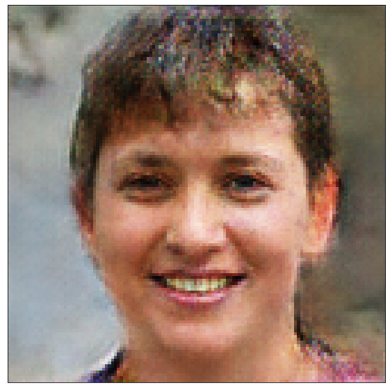
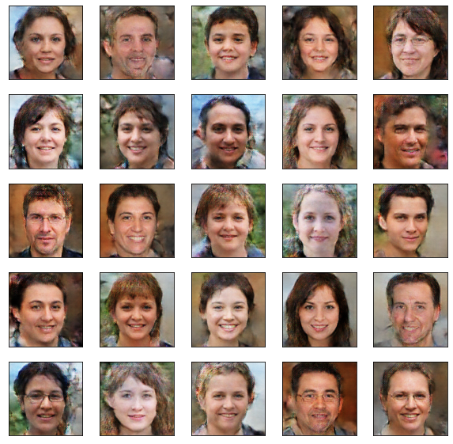
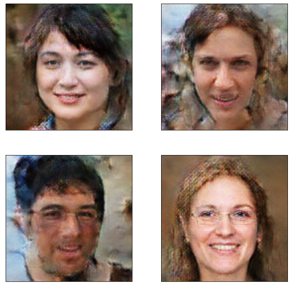

# 🧠 Synthetic Human Face Generation using GANs (Deep Learning)

This repository contains my **Deep Learning project** for generating synthetic human faces using **Generative Adversarial Networks (GANs)**.  

It includes both the **training notebook** and **interactive Streamlit applications** for **image generation** and **real/fake classification**.

---

## 🧩 Project Overview

The goal of this project is to train a **GAN (Generative Adversarial Network)** capable of generating realistic human faces from random noise vectors.  

The GAN architecture consists of two neural networks trained in competition:

- 🧠 **Generator**: learns to produce fake images that look like real human faces.
- 
- 🔍 **Discriminator**: learns to distinguish between real images and generated ones.

Through adversarial training, both networks improve together — resulting in highly realistic synthetic faces.

---

## 📂 Repository Structure

📦 Synthetic_Human_Face_Generation_GANs_deep_learning

│

├── Synthetic_face_generation_gan.ipynb # Jupyter notebook for model training

├── app3.py # Streamlit app for generation + classification

├── prediction.py # Streamlit app using joblib models

├── app.py # Initial version of the Streamlit app

└── README.md # Project documentation

---

## 🧠 Model Architecture

### Generator
- Input: Random noise vector (latent dimension = 100)
- Layers:
  - Dense layer + Reshape
  - Several Conv2D and Conv2DTranspose layers
  - Batch Normalization and LeakyReLU activations
  - Final layer uses `tanh` activation for image output
- Output: Synthetic image of size **128x128x3**

### Discriminator
- Input: Real or generated image
- Layers:
  - Multiple Conv2D layers with stride 2
  - Batch Normalization and LeakyReLU
  - Flatten + Dense (sigmoid activation)
- Output: Probability that the image is “real”

---

## 🧰 Libraries Used

- **TensorFlow / Keras** — model building and training  
- **NumPy** — numerical operations  
- **Matplotlib / Seaborn** — visualization and plotting  
- **OpenCV** — image handling  
- **Streamlit** — building interactive web apps  
- **tqdm** — progress tracking  
- **Joblib** — model saving/loading for lightweight apps  

---

## 📊 Training Details

- **Dataset:** Human face dataset (e.g., *Face Mask Lite Dataset – Without Mask subset* or any similar face dataset)
- **Image size:** 128×128 RGB
- **Noise vector (z):** 100 dimensions  
- **Optimizer:** RMSProp (learning rate = 0.0001)  
- **Loss function:** Binary Crossentropy  
- **Epochs:** ~30  
- **Batch size:** 32  

During training:
- The generator tries to fool the discriminator.
- The discriminator learns to correctly classify real vs generated faces.
- The loss curves gradually converge, showing adversarial learning stability.

---

## 🧮 Example Outputs

Here are some examples of generated faces after ~30 epochs of training:

| Epoch 30 | Epoch 20 | Epoch 10 |
|-----------|-----------|-----------|
|  |  |  |

*(Generated samples improve over time as the GAN learns visual features.)*

---

## 🚀 Streamlit Applications

### 🎨 1. **Image Generator**
- Run locally:

streamlit run app3.py 

- Features:

Slider to select number of generated images.

Displays high-quality synthetic human faces generated by the trained model.

### 🔍 2. Real vs Fake Image Classifier

Also in app3.py:

- Upload any image (JPG).

- The model predicts whether the image is real or synthetic using the discriminator.

## 🧩 Alternative: Lightweight Version (Joblib)

If you’ve saved models using Joblib, you can use:

- streamlit run prediction.py
  
- This version loads .joblib models and generates images using the same GAN logic.

## 🏁 Results & Observations

✅ The generator successfully produces realistic, smooth facial features after enough epochs.
✅ The discriminator stabilizes around 0.5 accuracy — indicating balanced competition.
⚙️ The model can be fine-tuned with more epochs and better face datasets (e.g., CelebA).

## 📈 Future Improvements

Use Progressive GANs (PGGAN) or StyleGAN for higher-quality faces.

Apply Data Augmentation and Transfer Learning on pre-trained GANs.

Build a web demo for users to generate faces live.

## 👨‍💻 Author

Islam Roubache

🎓 Master’s Student in Artificial Intelligence & Data Science

📍 Higher School of Computer Science 08 May 1945 – Sidi Bel Abbes, Algeria

## 🪪 License

This project is licensed under the MIT License – feel free to use, modify, and share with proper credit.

  
###  “GANs don’t just learn to generate data — they learn to imagine.” 💫

